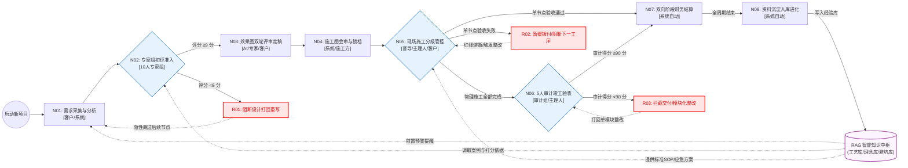

# AXS 全链路业务工作流节点配置说明书 (原子化版)

本文档基于《AXS 装修管理系统 - 系统使用总说明》中“最终完整版规范架构”的 8 大业务主流程，采用**原子化思维**进行深度拆解。
将每个宏观业务节点细化至：**执行权限角色、输入来源、原子动作序列、输出物、以及异常熔断条件**，为 N8N 底层配置及智能 Agent 动作编排提供最小颗粒度的执行脚手架。

## 一、 原子业务节点配置表 (含执行权限与原子动作)

| 节点ID | 节点名称 | 执行权限角色 | 前置节点 | 核心入参 (Input) | 原子动作序列 (Atomic Actions) | 核心出参 (Output) | 异常阻断 (Fallback) |
|---|---|---|---|---|---|---|---|
| N01 | 三维度客户需求采集 | 客户 / 主理人 / 系统 | RAG知识库预警 | H5探针数据、用户对话日志 | 1.提取量化硬性参数 2.推演隐性审美画像 3.映射功能美学需求 4.编译汇总输出 | 《标准化设计语言需求说明书》 | 无 (标准起点) |
| N02 | 专家组 Scrum 初评 | 10人专家组 | N01 | 需求说明书、RAG行业标准 | 1.调取历史打分案例 2.跨维度对标打分 3.判定是否达到9分阈值 | 带有评分的评审意见书 | **[R01]** <9分触发红色拦截，打回重写需求 |
| N03 | 效果图生成与定稿 | AI系统 / 专家组 / 客户 | N02 | 评审合格的说明书 | 1.多方案初步生成 2.专家组二次复审(≥9分) 3.客户反馈与文字修改 4.循环迭代至双确认定稿 | 最终确稿版效果图方案 | 客户/专家不满意则持续微调，不流向下级 |
| N04 | 施工方案会审锁档 | 系统 / 施工负责人 | N03 | 定稿版效果图 | 1.效果图转译CAD施工图 2.编制工序SOP与材料单 3.施工方研读与释疑 4.签字确认并云端锁档 | 锁档版施工文件集 (唯一执行准则) | 施工方存疑则闭环修改后方可签字 |
| N05 | 分级施工节点管控 | 现场督导 / 主理人 / 客户 | N04 | 锁档图纸、现场抓拍凭证 | 1.对比SOP进行显性工序快验 2.隐蔽/高决策工序触发审批 3.对比判断通过与否 | 节点验收通过凭证 | **[R02]** 验收失败触发红线熔断，打回整改，拦截拨款 |
| N06 | 竣工审计总验收 | 5人审计组 / 主理人 | N05 | 全周期存档凭证、交付物 | 1.对标全流程资料逐项打分 2.主理人复核并出具报告 3.客户最终签字确认 | 验收合格报告 (≥90分) | **[R03]** <90分强制阻断交付，打回按工种模块化整改 |
| N07 | 双向财务分阶结算 | 系统财务模块 | N05、N06 | 各类验收通过凭证、合同约定 | 1.核验工序留痕完整性 2.执行客户五档付款指令 3.执行施工方单工种拨付指令 | 系统资金拨付流水 | **[R02/R03]** 无合格凭证暂缓付款以倒逼质量 |
| N08 | 资料沉淀与系统进化 | 自动化数据脚本 | N07及全局 | 全局错题本、日志、客评 | 1.提取高频问题存入预警库 2.提取优质案例加权 3.结构化数据并写入外挂大脑 | 01_知识资产库 (RAG) | 无 (终结闭环) |

## 二、 业务工作流可视化图 (N8N 对标逻辑)

