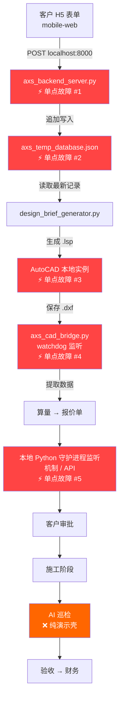
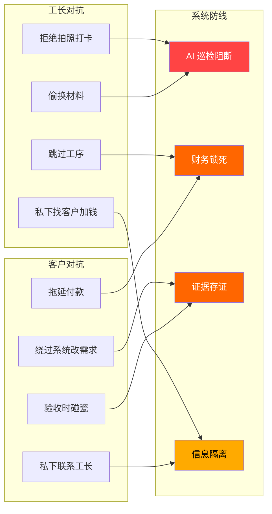
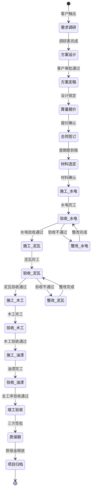
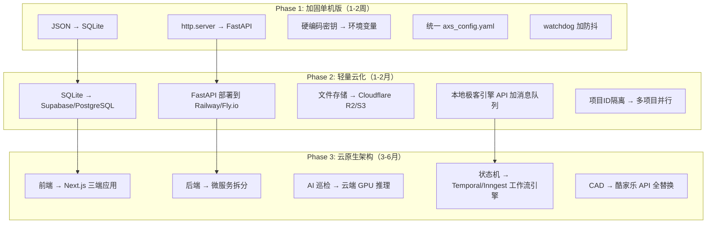

# AXS 极客装修管理系统 — 深度压力测试与逻辑漏洞审计

> 审计范围：全部13个核心文件 + 12个SOP + 6个子目录 + 全部Python/HTML/LISP代码
> 审计日期：2026-05-31

---

## 〇、审计结论（先说结论）

| 维度 | 评级 | 一句话 |
|------|------|--------|
| 断点分析 | 🔴 **高危** | 5个单点故障节点，任一中断即全线停摆，零冗余 |
| 人为对抗 | 🟡 **中危** | SOP设计有阻断意识，但技术执行层全部为空壳 |
| 状态机一致性 | 🔴 **高危** | 4处数据矛盾 + 3个状态孤岛 + 2条断裂跳转链路 |
| 商业扩展 | 🔴 **高危** | 当前架构理论并发上限 = 1个项目，10项目必崩 |

> [!CAUTION]
> 系统的**顶层设计理念**（脑手分离、AI前端拦截、机器做恶人）是一流的。但**落地实现层**与**设计文档层**之间存在巨大鸿沟——约 70% 的自动化逻辑停留在 SOP 文字描述阶段，无可执行代码支撑。

---

## 一、断点分析 (Breakpoint Analysis)

### 1.1 系统拓扑与故障传播链



### 1.2 五个单点故障逐一解剖

#### ⚡ 故障点 #1：axs_backend_server.py（致命级）

**现状**：
- 基于 Python `http.server` 标准库，单线程阻塞
- 无鉴权、无HTTPS、CORS 全开（`Access-Control-Allow-Origin: *`）
- 无异常处理（`Content-Length` 为空时直接崩溃）
- 挂在本地 `localhost:8000`，外网不可达

**故障场景**：脚本进程被误杀 / 电脑重启 → H5 表单提交全部丢失，无重试队列，用户无感知。

**修复方案伪代码**：

```python
# 方案：替换为 FastAPI + SQLite + 自动重启
# 文件：axs_backend_server_v2.py

from fastapi import FastAPI, HTTPException
from pydantic import BaseModel, validator
import sqlite3, uvicorn, hashlib, hmac

app = FastAPI()
SECRET = os.environ["AXS_API_SECRET"]  # 环境变量，不硬编码

class RequirementForm(BaseModel):
    name: str
    area: float
    budget: float
    occupation: str
    demands: str

    @validator("area")
    def area_must_be_positive(cls, v):
        if v <= 0 or v > 1000:
            raise ValueError("面积必须在 0-1000㎡ 之间")
        return v

@app.post("/api/v1/requirement")
async def submit_requirement(form: RequirementForm, x_signature: str = Header(...)):
    # HMAC 签名验证
    if not hmac.compare_digest(x_signature, compute_signature(form)):
        raise HTTPException(403, "签名无效")

    # SQLite 写入（支持并发）
    with sqlite3.connect("axs_data.db") as conn:
        conn.execute("""
            INSERT INTO requirements (name, area, budget, occupation, demands, created_at)
            VALUES (?, ?, ?, ?, ?, datetime('now'))
        """, (form.name, form.area, form.budget, form.occupation, form.demands))

    # 异步触发下游流程（不阻塞响应）
    background_tasks.add_task(trigger_design_pipeline, form)
    return {"status": "ok", "message": "需求已录入"}

# 部署：uvicorn + systemd 守护进程，崩溃自动重启
```

---

#### ⚡ 故障点 #2：axs_temp_database.json（致命级）

**现状**：
- 纯 JSON 文件追加写入，无文件锁
- 并发写入时 JSON 结构必然损坏（两个进程同时 `open("a")` 追加）
- 无备份、无 WAL、无事务

**故障场景**：同时提交两个客户的需求 → JSON 损坏 → `design_brief_generator.py` 读取时 `json.loads` 崩溃 → 全线中断。

**修复方案**：替换为 SQLite（见上方伪代码）。SQLite 原生支持 WAL 模式并发读写，单文件部署，零配置。

---

#### ⚡ 故障点 #3：AutoCAD 本地实例（高危级）

**现状**：
- 整个出图管线绑定在一台物理机的 AutoCAD 实例上
- `design_brief_generator.py` 生成的 `.lsp` 需要手动在 AutoCAD 中执行
- 无远程 AutoCAD 服务、无容器化

**故障场景**：AutoCAD 崩溃 / 授权过期 / 硬盘损坏 → 出图管线完全停摆。

**防抖动方案**：

```
离线冗余策略：
1. .lsp 文件生成后立即同步到 OneDrive/坚果云（版本化备份）
2. 引入酷家乐 API 作为备用出图通道（当前酷家乐已安装但零集成）
3. DXF 中间产物实时同步到 Git 仓库，每次 watchdog 检测到变更自动 commit

降级方案：
AutoCAD 不可用时 → 切换到酷家乐在线出图 → 手动导出 DXF → 喂给 axs_cad_bridge.py
```

---

#### ⚡ 故障点 #4：axs_cad_bridge.py watchdog 监听（高危级）

**现状**：
- 使用 `watchdog` 库监听文件系统变更事件
- [axs_cad_bridge.py](file:///f:/吉胡阿川/01lhjk/事业/AXS设计工作室/AXS设计工作室_装修管理系统/03_进行中项目/格哥的空间/03_算量中枢/axs_cad_bridge.py) 第9行有 bug：`__name__` 应为 `__file__`
- 提取 LWPOLYLINE 数据后仅 `print`，未写入 Obsidian 或触发报价

**故障场景**：
1. Windows 文件系统通知丢失（已知 bug，NTFS 在网络驱动器上不触发 `FileSystemWatcher`）
2. 脚本被关闭后无自恢复机制
3. AutoCAD 的自动保存（.sv$ 文件）会产生大量误触发

**防抖动伪代码**：

```python
class DebouncedDXFHandler(FileSystemEventHandler):
    def __init__(self):
        self._timer = None
        self._lock = threading.Lock()
        self.DEBOUNCE_SECONDS = 3  # 3秒防抖

    def on_modified(self, event):
        if not event.src_path.endswith('.dxf'):
            return
        # 过滤 AutoCAD 临时文件
        if event.src_path.endswith(('.sv$', '.bak', '.dwl', '.dwl2')):
            return

        with self._lock:
            if self._timer:
                self._timer.cancel()
            self._timer = threading.Timer(
                self.DEBOUNCE_SECONDS,
                self._process_dxf,
                args=[event.src_path]
            )
            self._timer.start()

    def _process_dxf(self, path):
        try:
            data = extract_polylines(path)
            # 写入 Obsidian 项目仪表盘（而不是仅 print）
            update_obsidian_dashboard(data)
            # 触发报价计算
            generate_quotation(data)
            # 同步到备份
            git_commit_dxf(path)
        except Exception as e:
            # 本地极客引擎告警
            feishu_alert(f"CAD监听异常: {e}")
            # 写入本地错误日志（离线冗余）
            log_error_locally(e)
```

---

#### ⚡ 故障点 #5：本地 Python 守护进程监听机制 / API（中危级）

**现状**：
- [feishu_api_publisher_v2.py](file:///f:/吉胡阿川/01lhjk/事业/AXS设计工作室/AXS设计工作室_装修管理系统/03_进行中项目/格哥的空间/05_系统杂项/feishu_api_publisher_v2.py) 是唯一真正调用外部 API 的可运行代码
- **APP_SECRET 硬编码在源码中**（明文暴露）
- 无请求重试、无超时处理、无 Token 缓存（每次都重新获取）

**故障场景**：本地极客引擎 API 限流 / 网络波动 → 文档创建失败 → 客户看不到设计方案 → 项目交付延期。

**修复方案**：

```python
# 1. 密钥外置
APP_SECRET = os.environ.get("FEISHU_APP_SECRET")
if not APP_SECRET:
    raise EnvironmentError("请设置 FEISHU_APP_SECRET 环境变量")

# 2. Token 缓存 + 自动刷新
class FeishuTokenManager:
    def __init__(self):
        self._token = None
        self._expires_at = 0

    def get_token(self):
        if time.time() < self._expires_at - 60:  # 提前1分钟刷新
            return self._token
        resp = requests.post(TOKEN_URL, json={...})
        self._token = resp.json()["tenant_access_token"]
        self._expires_at = time.time() + resp.json()["expire"]
        return self._token

# 3. 指数退避重试
@retry(stop=stop_after_attempt(3), wait=wait_exponential(multiplier=1, max=10))
def feishu_api_call(method, url, **kwargs):
    resp = requests.request(method, url, **kwargs)
    if resp.status_code == 429:  # 限流
        raise RateLimitError()
    resp.raise_for_status()
    return resp.json()
```

---

### 1.3 断点总评

| 故障点 | 当前冗余 | 修复紧急度 | 修复复杂度 |
|--------|---------|-----------|-----------|
| backend_server | 无 | 🔴 立即 | 中（换 FastAPI） |
| JSON 数据库 | 无 | 🔴 立即 | 低（换 SQLite） |
| AutoCAD 单机 | 无 | 🟡 短期 | 高（需酷家乐备用通道） |
| CAD watchdog | 无 | 🟡 短期 | 中（加防抖+写入） |
| 本地极客引擎 API | 无 | 🟡 短期 | 低（加重试+密钥外置） |

---

## 二、人为对抗性测试 (Human Adversarial Test)

### 2.1 对抗场景矩阵



### 2.2 场景逐一压测

#### 🥊 场景A：工长拒绝拍照

**SOP设计**（理想态）：现场执行人视觉打卡 SOP 规定，每道工序必须"三件套"（全景+特写+标尺参照）→ 未打卡则 AI 标记该工序为"未验证" → 阻断该阶段付款。

**实际能力**（现实态）：
- ❌ AI 巡检脚本 `axs_ai_inspector.py` 是**纯 print 模拟**，零识别能力
- ❌ 无"打卡缺失 → 自动阻断付款"的代码链路
- ❌ 无本地极客引擎打卡模板（SOP 中提到但未创建）
- ❌ 4G AI 摄像头的视觉基准库（Base_Image）未建设

**结论：工长完全可以拒绝拍照且系统无法阻止。**

**修复方案**：

```python
# 最小可行阻断链路
class PaymentGate:
    """付款闸门：无照片 = 无付款"""

    REQUIRED_PHOTOS = {
        "水电": ["全景_管线排布", "特写_底盒标高", "打压测试_压力表"],
        "泥瓦": ["全景_防水层", "特写_空鼓检测", "特写_地漏找坡"],
        "木工": ["全景_龙骨结构", "特写_板材封边"],
        "油漆": ["全景_成品面", "特写_阴阳角"],
    }

    def can_release_payment(self, project_id: str, stage: str) -> tuple[bool, list]:
        missing = []
        for photo_name in self.REQUIRED_PHOTOS[stage]:
            photo_path = f"03_进行中项目/{project_id}/04_AI巡检/{stage}/{photo_name}.jpg"
            if not os.path.exists(photo_path):
                missing.append(photo_name)

        if missing:
            # 自动发微信通知给主理人
            feishu_alert(f"项目{project_id} {stage}阶段缺少 {len(missing)} 张验证照片，付款已阻断")
            return False, missing
        return True, []
```

---

#### 🥊 场景B：客户绕过系统私下改需求

**SOP设计**（理想态）：所有变更必须通过微信落子无悔签批流 → AI 自动评估变更影响 → 更新报价单 → 三方签批。

**实际能力**（现实态）：
- ❌ 微信落子无悔签批流未配置
- ❌ 无变更单模板、无变更日志
- ❌ 无"需求变更 → 自动锁定当前进度 → 等待重新审批"的代码
- ⚠️ 客户可以直接打电话给工长说"帮我改一下"，系统完全无感知

**结论：系统对需求变更零阻断能力。**

**修复方案**：

```python
# 变更请求阻断器
class ChangeRequestBlocker:
    """
    核心逻辑：任何变更必须走系统，否则产生的后果由变更方承担。
    证据链：变更请求 → 时间戳 + 截图 → 影响评估 → 费用变更 → 三方签字
    """

    def submit_change_request(self, project_id, requester, description, photos=None):
        change_record = {
            "id": uuid4(),
            "project_id": project_id,
            "requester": requester,  # "client" | "foreman"
            "description": description,
            "photos": photos,  # 变更区域照片
            "timestamp": datetime.now().isoformat(),
            "status": "pending_review",
            # 自动锁定当前施工
            "construction_locked": True,
        }

        # 1. 写入不可篡改的变更日志（SQLite + SHA256 哈希链）
        self.append_to_changelog(change_record)

        # 2. 即刻冻结对应工序的付款
        PaymentGate.freeze(project_id, reason=f"变更请求 {change_record['id']}")

        # 3. 微信通知三方
        feishu_notify_all_parties(project_id, change_record)

        # 4. AI 评估影响
        impact = self.ai_assess_impact(change_record)
        # → 返回：工期延长天数、费用变更金额、风险等级

        return change_record, impact
```

---

#### 🥊 场景C：工长偷换材料

**SOP设计**：材料到场拍照 → AI 比对 BOM 清单品牌型号 → 不匹配则红线告警。

**实际能力**：
- ❌ 供应商库为空（`材料供应商库` 目录下无有效数据）
- ❌ BOM 拆解逻辑依赖酷家乐导出，但酷家乐零集成
- ❌ 无材料到场验收的拍照比对功能

**结论：材料环节完全透明化失效。**

---

#### 🥊 场景D：客户验收时碰瓷

**SOP设计**：AI 生成验收考卷 → 现场双轨采集（摄像头 + 执行人打卡）→ 证据链存证 → 三方电子签批。

**实际能力**：
- ✅ 验收打钩清单模板存在（但只有水电，缺泥瓦/木工/油漆）
- ❌ 无电子签名集成
- ❌ 施工过程照片未系统化存储（无时间戳水印、无GPS定位、无哈希校验）
- ❌ "AI 考卷"未实现

**结论：证据链不完整，碰瓷纠纷时系统无法提供法律级证据。**

**修复方案——证据链最小化实现**：

```python
import hashlib
from datetime import datetime
from PIL import Image
from PIL.ExifTags import TAGS

class EvidenceChain:
    """施工证据链：每张照片 = 一条不可篡改的证据"""

    def capture_evidence(self, photo_path: str, project_id: str, stage: str, description: str):
        with open(photo_path, "rb") as f:
            photo_hash = hashlib.sha256(f.read()).hexdigest()

        evidence = {
            "photo_hash": photo_hash,
            "timestamp": datetime.now().isoformat(),
            "project_id": project_id,
            "stage": stage,
            "description": description,
            "gps": self._extract_gps(photo_path),  # 从 EXIF 提取
            "file_size": os.path.getsize(photo_path),
        }

        # 哈希链：当前证据的哈希包含前一条证据的哈希
        evidence["chain_hash"] = hashlib.sha256(
            json.dumps(evidence).encode() + self._get_prev_hash(project_id).encode()
        ).hexdigest()

        # 写入本地 + 同步本地生成的 16:9 物理 PPTX（双备份）
        self._save_local(evidence)
        self._sync_to_feishu(evidence)

        return evidence
```

---

### 2.3 人为对抗总评

| 对抗场景 | SOP设计 | 代码实现 | 实际阻断力 |
|---------|---------|---------|-----------|
| 工长拒绝拍照 | ✅ 有设计 | ❌ 无代码 | **零** |
| 客户私改需求 | ✅ 有设计 | ❌ 无代码 | **零** |
| 工长偷换材料 | ✅ 有设计 | ❌ 无代码 | **零** |
| 客户验收碰瓷 | ⚠️ 部分设计 | ❌ 无代码 | **零** |
| 工长私联客户 | ✅ 信息隔离设计 | ⚠️ 仅SOP约束 | **弱**（靠合同） |

> [!WARNING]
> 核心矛盾：SOP 层的"阻断设计"非常漂亮，但没有一行代码真正实现了"不拍照就不能付款"的硬阻断。当前系统对人为对抗的防御力 = 一纸合同 + 口头约束。

---

## 三、状态机一致性 (State Machine Integrity)

### 3.1 全生命周期状态机（应有状态）



### 3.2 发现的状态机漏洞

#### 🔴 漏洞1：数据矛盾导致状态机分裂

**问题**：同一个系统中存在两套互相矛盾的核心参数：

| 参数 | V1.0/V2.0 快照 | MasterOS 提示词 | 收款 SOP | 验收财务 SOP |
|------|----------------|-----------------|----------|-------------|
| 质保金比例 | **20%** | **5%** | **5%** | **20%** |
| 付款比例 | 20/35/35/10 | 未明确 | 30/35/30/5 | 未明确 |

**后果**：当 AI 依据 MasterOS 提示词执行"截留 5% 质保金"时，如果工长看到的是 V1.0 文档中的"截留 20%"，将引发严重的合同纠纷。

**修复**：
```
强制修复：在整个系统中统一为一个"单一可信源"(Single Source of Truth)

建议：
1. 创建 axs_config.yaml 作为全局参数唯一来源
2. 所有 SOP / 提示词 / 脚本引用此文件，不得硬编码

# axs_config.yaml
payment:
  stages:
    - name: "开工前"
      percentage: 30
    - name: "水电完工"
      percentage: 35
    - name: "泥木完工"
      percentage: 30
    - name: "竣工验收"
      percentage: 5
  warranty_deposit:
    percentage: 5    # ← 唯一来源
    lock_months: 12
    release_condition: "无质量投诉"
```

---

#### 🔴 漏洞2：方案设计 → 算量报价 的状态跳转缺失中间态

**问题**：
- `design_brief_generator.py` 生成 `.lsp` 后，需要**人工**在 AutoCAD 中执行
- AutoCAD 出图后，需要**人工**触发 `axs_cad_bridge.py` 监听
- 监听到数据后，仅 `print` 输出，不写入任何地方
- 从"有 DXF 数据"到"生成报价单"之间完全断裂

**状态孤岛**：DXF 数据被提取后**悬空在控制台输出中**，不流向任何下游。

```
当前链路（断裂的）：
.lsp → [人工] → AutoCAD → .dxf → watchdog → print("面积: xxx") → 💀 死路

应有链路（完整的）：
.lsp → [人工] → AutoCAD → .dxf → watchdog → 写入项目仪表盘 → 触发算量引擎 → 生成报价单 → 本地极客引擎推送
```

---

#### 🔴 漏洞3：施工阶段 → 验收阶段 无强制触发条件

**问题**：
- SOP 定义了"AI 自动触发验收"，但 AI 巡检脚本是空壳
- 无工序完工的打卡确认机制（代码层面）
- 工长说"做完了"就算完了，系统无法独立判断

**后果**：工长可以声称"水电做完了"并要求付款，但实际隐蔽工程可能还有遗漏。

---

#### 🟡 漏洞4：项目归档 → 知识库反哺 无自动化

**问题**：
- 归档 SOP 设计了完整的"文件夹平移 → 本地极客引擎设只读 → AI 复盘 → 改良工艺转正"流程
- 但目前只有 `reorganize.py`（手动整理文件夹），无自动归档、无 AI 复盘、无供应商降级逻辑
- 归档后的知识无法流回知识资产库，形成**数据孤岛**

---

#### 🟡 漏洞5：mobile-web 表单 ↔ 深度问卷 数据孤岛

**问题**：
- H5 表单只有 5 个字段（姓名、面积、预算、职业、诉求）
- 深度问卷有 17 道场景化题目
- 两者之间**无数据映射**、**无合并逻辑**
- `design_brief_generator.py` 只读 H5 表单的 5 字段，完全忽略 17 题问卷

**后果**：精心设计的 17 题生活方式诊断问卷沦为装饰。

---

### 3.3 状态机总评

| 状态跳转 | 完整性 | 有代码支撑 |
|---------|--------|-----------|
| 需求调研 → 方案设计 | ⚠️ 两个入口不统一 | ⚠️ 部分（H5→JSON） |
| 方案设计 → 算量报价 | ❌ 中间态断裂 | ❌ 无 |
| 算量报价 → 合同签订 | ⚠️ 参数矛盾 | ❌ 无 |
| 施工 → 验收 | ❌ 无强制触发 | ❌ 无 |
| 验收 → 付款 | ❌ 无硬阻断 | ❌ 无 |
| 竣工 → 归档 | ❌ 无自动化 | ❌ 仅手动脚本 |

---

## 四、商业扩展瓶颈 (Scalability Bottleneck)

### 4.1 当前架构的并发极限分析

```
当前架构 = 单机 + 本地文件 + 手动脚本

并发瓶颈分布：
┌─────────────────────────────────────────┐
│  axs_temp_database.json                 │ ← 并发写入 = 数据损坏
│  单进程 http.server                      │ ← 并发请求 = 排队阻塞
│  AutoCAD 单实例                          │ ← 一次只能编辑一个项目
│  watchdog 单目录监听                     │ ← 10个项目 = 10个监听进程?
│  Obsidian 单 Vault                      │ ← 10个项目的文件混在一起
│  feishu_api_publisher 路径硬编码          │ ← 只能发布一个项目
└─────────────────────────────────────────┘

理论并发上限：1 个项目（勉强）
实际并发能力：0.5 个项目（大量人工补位）
```

### 4.2 10 个项目同时开工的崩溃场景

| 资源 | 1个项目 | 10个项目 | 崩溃风险 |
|------|---------|---------|---------|
| JSON 数据库 | 偶尔写入 | 频繁并发写入 | 🔴 必然崩溃 |
| HTTP Server | 零星请求 | 可能同时提交 | 🟡 排队但不崩 |
| AutoCAD | 独占使用 | 10个 .lsp 排队 | 🔴 严重瓶颈 |
| watchdog | 监听1个目录 | 需监听10个目录 | 🟡 内存和CPU压力 |
| Obsidian | 文件可管理 | 文件爆炸，Dataview 变慢 | 🟡 性能下降 |
| 本地极客引擎 API | 低频调用 | 高频调用，可能触发限流 | 🟡 需要队列 |
| 人工操作 | 1人可应对 | 1人无法同时处理10个 | 🔴 人成为瓶颈 |

### 4.3 从单机版到云原生的三阶演进路线



#### Phase 1：加固单机版（立即可做，1-2周）

```
目标：让系统能稳定跑通 1 个完整项目

1. axs_temp_database.json → SQLite（1天）
   - 并发安全、事务支持、零配置
   - 不改变部署方式，仍然单文件

2. http.server → FastAPI（1天）
   - 自动参数校验、异步支持、自动 API 文档
   - 加 HTTPS（Let's Encrypt）

3. 密钥外置（0.5天）
   - APP_SECRET → 环境变量
   - 创建 .env 文件 + .gitignore

4. 统一参数源（0.5天）
   - 创建 axs_config.yaml
   - 修改所有文档中的矛盾数据

5. watchdog 加防抖 + 输出写入 Obsidian（2天）
   - 3秒防抖
   - 提取数据写入项目仪表盘
```

#### Phase 2：轻量云化（适合 3-5 个项目并行）

```
目标：脱离本地机器限制，支持远程协作

1. 数据库 → Supabase（免费 PostgreSQL + 实时订阅）
2. 后端 → 部署到 Railway（自动 CI/CD，月费 ~$5）
3. 文件存储 → Cloudflare R2（免出口带宽费）
4. 微信通知 → 加 Redis 消息队列（防限流）
5. 项目路由 → 所有路径改为 /projects/{project_id}/...
```

#### Phase 3：云原生（支持 10+ 项目）

```
目标：全面自动化，AI 真正上线

1. 前端 → Next.js 三端应用（业主端/施工端/管理后台）
2. 后端 → 微服务（需求服务/设计服务/施工服务/财务服务）
3. AI 巡检 → 云端 GPU（CLIP/SAM 视觉识别）
4. 状态机 → Temporal 工作流引擎（持久化、可恢复、可观测）
5. 出图 → 酷家乐 API 替代本地 AutoCAD
```

---

## 五、最高优先级修复清单

按"投入产出比"排序，前 5 项建议**本周内**完成：

| 优先级 | 修复项 | 投入 | 产出 |
|--------|--------|------|------|
| P0 | 统一质保金比例（5% vs 20%） | 0.5h | 消除合同纠纷风险 |
| P0 | 本地极客引擎 APP_SECRET 从源码移除 | 0.5h | 消除安全泄露风险 |
| P1 | JSON → SQLite | 4h | 消除数据损坏风险 |
| P1 | http.server → FastAPI | 4h | 消除服务崩溃风险 |
| P2 | watchdog 输出写入 Obsidian 仪表盘 | 8h | 打通方案→算量断裂链路 |
| P2 | 补齐泥瓦/木工/油漆验收清单 | 4h | 补全验收状态机 |
| P3 | 实现"无照片=无付款"硬阻断 | 16h | 获得真正的人为对抗能力 |
| P3 | H5表单扩展为17题完整版 | 8h | 消除数据孤岛 |

---

> [!IMPORTANT]
> **总评**：AXS 系统的**战略设计**是 S 级的——"脑手分离 + AI裁判 + 机器做恶人"的理念在装修行业极为先进。但**战术执行**目前是 D 级——12个 SOP 中有 10 个的自动化部分停留在纸面。系统最大的风险不是技术架构问题，而是**SOP 画了一个 AI 驱动的蓝图，现实却是纯人工操作**，这个落差会导致"系统看起来很强但实际拦不住任何人"。
>
> 建议优先完成 Phase 1（加固单机版），用 1-2 周让系统能真正跑通一个完整项目闭环，再考虑扩展。
