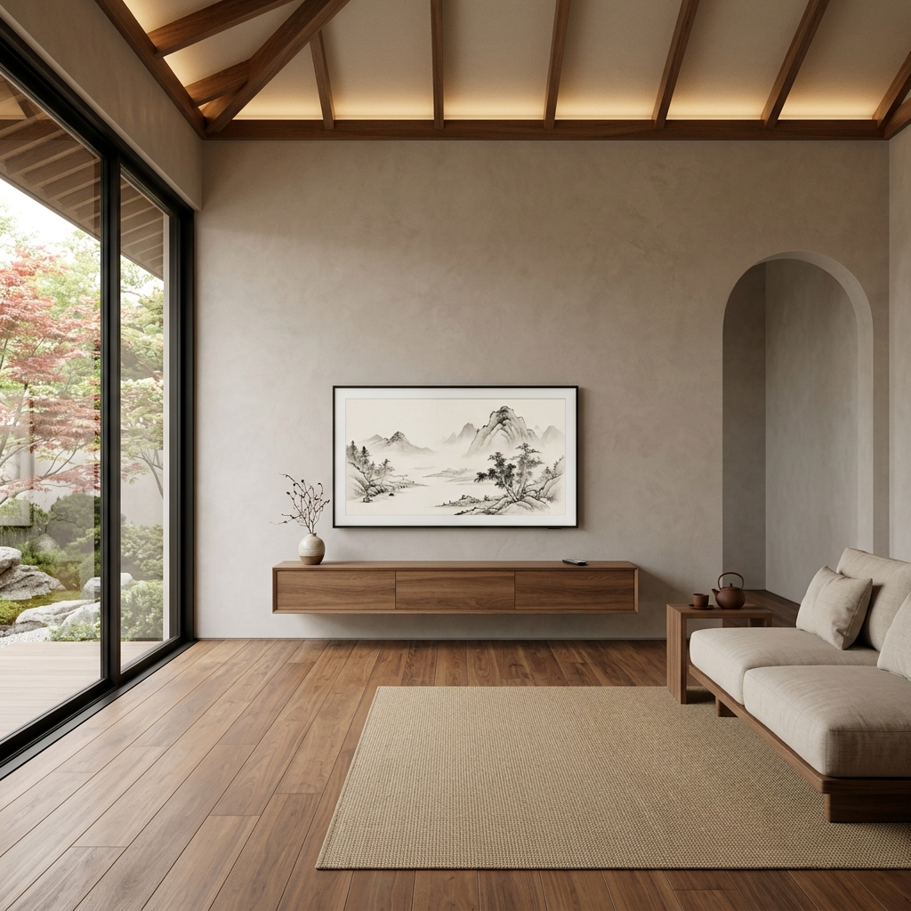
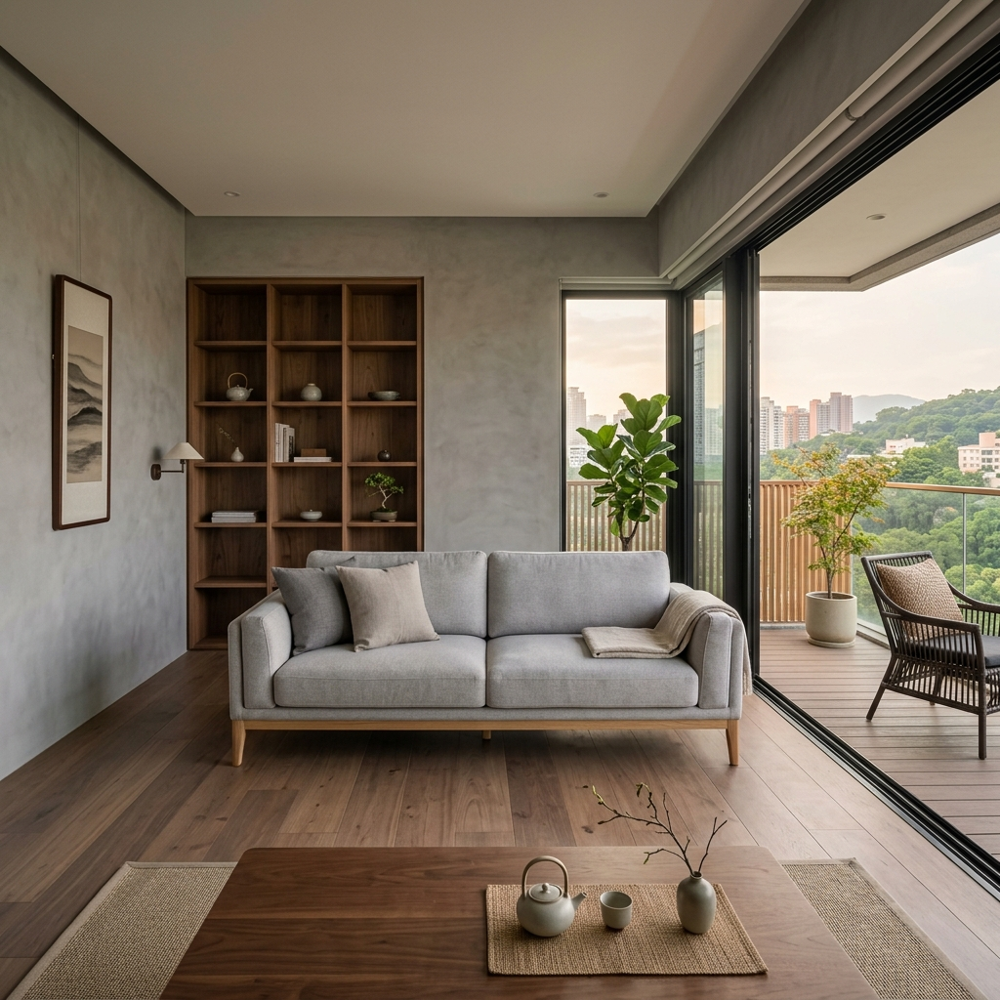
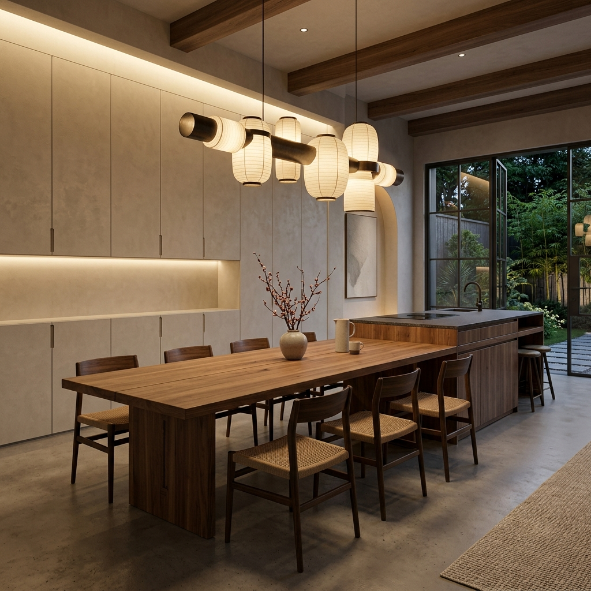
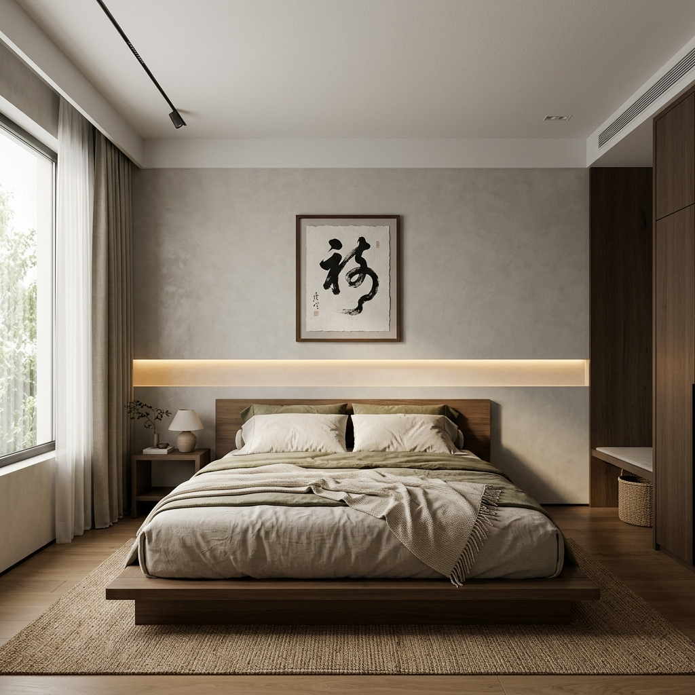
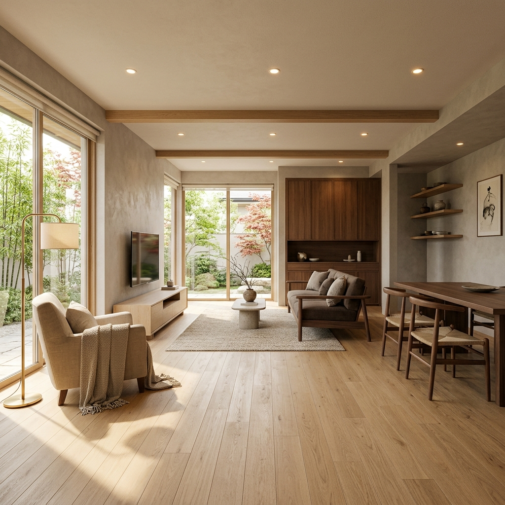

# 🖼️ 格哥的空间 - AXS 前端概念视觉交付

主理人您好，这里是第一阶段【前端概念出图引擎】基于推演报告自动生成的效果图资产。
系统严格遵循了“抛弃纯装饰”、“大面积留白”、“暖色光影”的设计红线。

## 🛋️ 核心空间视觉呈现

### 1. 客厅视角

### 2. 客厅沙发布局

### 3. 餐厅高频吞吐区

### 4. 主卧精神角落

### 5. 概念骨架轴测图

## 📂 本地物理图库说明
以上高清原图均与本文档存放在同一目录下，随时支持打包发送或通过飞书 API 自动推流。
