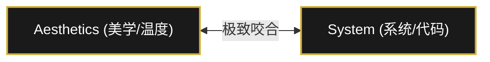
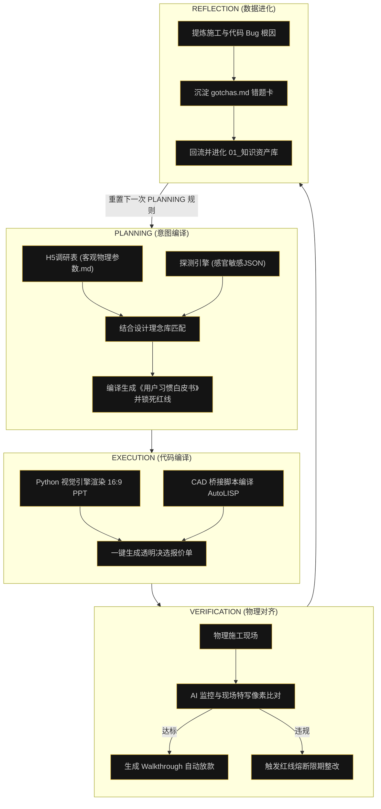

# ⚖️ AXS 设计系统最高宣言 (The AXS Creed)

> **“所有极致的实用主义与系统化的代码，最终，都是为了毫无痕迹地服务于您的审美与舒适。”**

---

## 🌌 一、 最高精神与信仰：美学 × 系统 (Aesthetics × System)

在传统家装行业的“价格猜疑、沟通内耗、现场实操”的重力摩擦中，AXS 是一面冷血而优雅的极客旗帜。我们坚信：**极致的功能性即绝对的美学**。我们杜绝一切增加家务内耗的无效装饰，用精密的逻辑与代码构建温暖的避风港。

> [!IMPORTANT]
> **AXS 终极信仰：**
> 摒弃高摩擦的人力对线，转而通过结构化的 **Agent 闭环（PLANNING - EXECUTION - VERIFICATION - REFLECTION）**，以代码逻辑为骨架，以极致美学为灵魂，实现设计的降维打击与系统的自主进化。

---

## 🛡️ 二、 三大信仰支柱 (The Three Pillars)

### 1. 脑手分离，极客隔离 (Separation of Brain & Hand)
*   **云端主理人**：坚守高维视角。只操纵系统规则、SOP 与代码逻辑，捍卫核心美学。不向下兼容泥水与粉尘，绝不对任何外界 SaaS 平台低头妥协。
*   **物理现场执行人**：代码系统在物理世界的“肉身化身”，负责高摩擦的实地对齐，拍摄隐蔽工程并转化为冷血系统所需的像素级客观数据。
*   **安全隔离圈**：主理人只操纵代码与规则，保持绝对的极客式静默。

### 2. 去 SaaS 化本地真相源 (SSOT)
*   **绝对掌控**：我们斩断外部平台的云端依赖，数据 100% 本地化。
*   **极客工具链**：以 Obsidian 存放标准工艺 SOP 与物料库为唯一真相源；以本地 H5 探针捕获潜意识；以 Python 视觉引擎渲染 16:9 物理 PPT 提案；以 AutoLISP 直接生成施工 DWG 代码。

### 3. 基于反射 (Reflection) 的自适应自进化
*   **错误即资产**：项目在物理世界的每一次报错、返工和冲突，在代码世界里都不是失败，而是系统演进的养分。
*   **错题本流转**：通过在 `VERIFICATION`（验证）阶段捕获 Bug，在 `REFLECTION`（反思）阶段提炼成 `gotchas.md` (避坑指南)，自动修改 Python/LISP 脚本和标准工艺库，实现系统的自主学习。

---

## 📜 三、 最高运营准则 (The Tenets)

> [!TIP]
> ### 1. 极致实用主义 (Practicality First)
> 任何不能减少家务内耗、不能提升起居舒适度的设计，都是废话。拒绝为了好看而妥协功能性，功能是第一序位。
>
> ### 2. 10% 绝对透明防线 (Zero-Spread Commission)
> 我们坚守仅收取合同 **10% 纯项目管理服务费** 的唯一商业模式。材料商与施工队 100% 零差价底价公开，用绝对的代码透明换取客户绝对的资金授权。
>
> ### 3. 限制红线熔断器 (Restrictions Guard)
> 客户需求探针中的“绝对不要”（Restrictions）是设计的最高红线。该红线硬编码在 Python 视觉和算量脚本中，一旦生成过程有红线违反，系统立即自我熔断并报错。

---

## 🔄 四、 Agentic 核心生命流转 (The Operational Loop)

每一套 AXS 住宅的诞生，都遵循以下圣捷的工作流闭环：

---

> **“以美学之名，用系统代码为客户筑巢。此为 AXS 之道。”**
